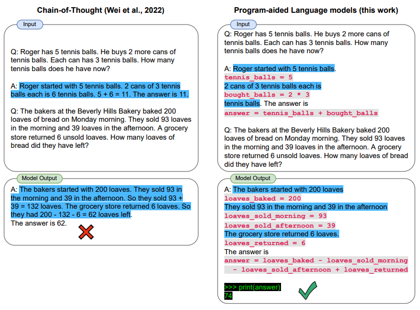

# Prompt Applications

在本指南中，我们将介绍一些高级和有趣的方法，我们可以使用提示工程来执行有用和更高级的任务。

**请注意，本节正在大力开发中**。
主题。
- [Generating Data](#generating-data)
- [Code as Reasoning](#pal-program-aided-language-models-code-as-reasoning)
- ...

---
## Generating Data

LLMs有很强的生成文本的能力。使用有效的提示策略可以引导模型产生更好的、一致的、更符合事实的反应。LLMs还可以特别用于生成数据，这对运行各种实验非常有用。例如，我们可以用它来为情感分类器快速生成样本，就像这样。

*Prompt:*
```
Produce 10 exemplars for sentiment analysis. Examples are categorized as either positive or negative. Produce 2 negative examples and 8 positive examples. Use this format for the examples:
Q: <sentence>
A: <sentiment>
```

*Output:*
```
Q: I just got the best news ever!
A: Positive

Q: We just got a raise at work!
A: Positive

Q: I'm so proud of what I accomplished today.
A: Positive

Q: I'm having the best day ever!
A: Positive

Q: I'm really looking forward to the weekend.
A: Positive

Q: I just got the best present ever!
A: Positive

Q: I'm so happy right now.
A: Positive

Q: I'm so blessed to have such an amazing family.
A: Positive

Q: The weather outside is so gloomy.
A: Negative

Q: I just got some terrible news.
A: Negative
```

这是很有用的。实际上，我们在指南的另一部分中对一个不同的测试使用这个例子。

---

## PAL (Program-Aided Language Models): Code as Reasoning
 
[Gao et al., (2022)](https://arxiv.org/abs/2211.10435) 提出了一种使用LLM来读取自然语言问题并生成程序作为中间推理步骤的方法。称为程序辅助语言模型（PAL），它与思维链提示的不同之处在于，它不是使用自由格式的文本来获得解决方案，而是将解决方案的步骤卸载到一个程序化的运行时间，如Python解释器。



让我们看看一个使用LangChain和OpenAI GPT-3的例子。我们有兴趣开发一个简单的应用程序，它能够通过利用Python解释器来解释所问的问题并提供答案。

具体来说，我们有兴趣创建一个功能，允许使用LLM来回答那些需要理解日期的问题。我们将为LLM提供一个提示，其中包括一些从[这里](https://github.com/reasoning-machines/pal/blob/main/pal/prompt/date_understanding_prompt.py)采用的范例。 

这些是我们需要的进口。

```python
import openai
from datetime import datetime
from dateutil.relativedelta import relativedelta
import os
from langchain.llms import OpenAI
from dotenv import load_dotenv
```

让我们首先配置一些东西。

```python
load_dotenv()

# API configuration
openai.api_key = os.getenv("OPENAI_API_KEY")

# for LangChain
os.environ["OPENAI_API_KEY"] = os.getenv("OPENAI_API_KEY")
```

设置模型实例

```python
llm = OpenAI(model_name='text-davinci-003', temperature=0)
```

设置提示+问题。

```python
question = "Today is 27 February 2023. I was born exactly 25 years ago. What is the date I was born in MM/DD/YYYY?"

DATE_UNDERSTANDING_PROMPT = """
# Q: 2015 is coming in 36 hours. What is the date one week from today in MM/DD/YYYY?
# If 2015 is coming in 36 hours, then today is 36 hours before.
today = datetime(2015, 1, 1) - relativedelta(hours=36)
# One week from today,
one_week_from_today = today + relativedelta(weeks=1)
# The answer formatted with %m/%d/%Y is
one_week_from_today.strftime('%m/%d/%Y')
# Q: The first day of 2019 is a Tuesday, and today is the first Monday of 2019. What is the date today in MM/DD/YYYY?
# If the first day of 2019 is a Tuesday, and today is the first Monday of 2019, then today is 6 days later.
today = datetime(2019, 1, 1) + relativedelta(days=6)
# The answer formatted with %m/%d/%Y is
today.strftime('%m/%d/%Y')
# Q: The concert was scheduled to be on 06/01/1943, but was delayed by one day to today. What is the date 10 days ago in MM/DD/YYYY?
# If the concert was scheduled to be on 06/01/1943, but was delayed by one day to today, then today is one day later.
today = datetime(1943, 6, 1) + relativedelta(days=1)
# 10 days ago,
ten_days_ago = today - relativedelta(days=10)
# The answer formatted with %m/%d/%Y is
ten_days_ago.strftime('%m/%d/%Y')
# Q: It is 4/19/1969 today. What is the date 24 hours later in MM/DD/YYYY?
# It is 4/19/1969 today.
today = datetime(1969, 4, 19)
# 24 hours later,
later = today + relativedelta(hours=24)
# The answer formatted with %m/%d/%Y is
today.strftime('%m/%d/%Y')
# Q: Jane thought today is 3/11/2002, but today is in fact Mar 12, which is 1 day later. What is the date 24 hours later in MM/DD/YYYY?
# If Jane thought today is 3/11/2002, but today is in fact Mar 12, then today is 3/1/2002.
today = datetime(2002, 3, 12)
# 24 hours later,
later = today + relativedelta(hours=24)
# The answer formatted with %m/%d/%Y is
later.strftime('%m/%d/%Y')
# Q: Jane was born on the last day of Feburary in 2001. Today is her 16-year-old birthday. What is the date yesterday in MM/DD/YYYY?
# If Jane was born on the last day of Feburary in 2001 and today is her 16-year-old birthday, then today is 16 years later.
today = datetime(2001, 2, 28) + relativedelta(years=16)
# Yesterday,
yesterday = today - relativedelta(days=1)
# The answer formatted with %m/%d/%Y is
yesterday.strftime('%m/%d/%Y')
# Q: {question}
""".strip() + '\n'
```

```python
llm_out = llm(DATE_UNDERSTANDING_PROMPT.format(question=question))
print(llm_out)
```

```python
exec(llm_out)
print(born)
```

这将输出以下信息。`02/27/1998`

See full notebook [here](../notebooks/pe-pal.ipynb)

---

More examples coming soon!

[Previous Section (Advanced Usage)](./prompts-advanced-usage.md)

[Next Section (ChatGPT)](./prompts-chatgpt.md)
